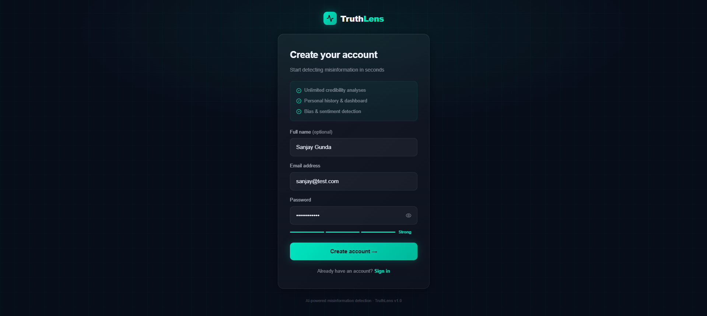
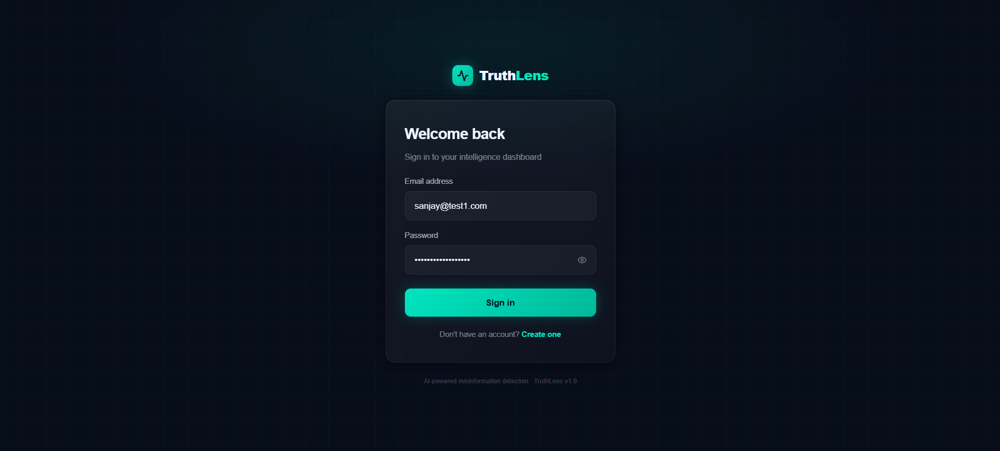
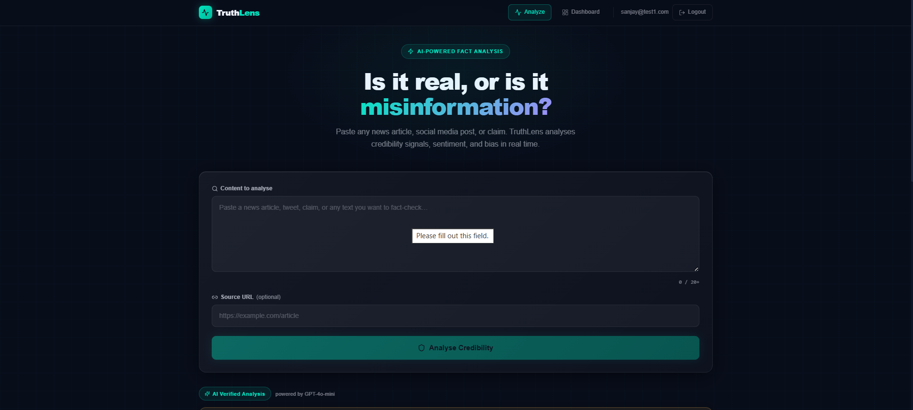
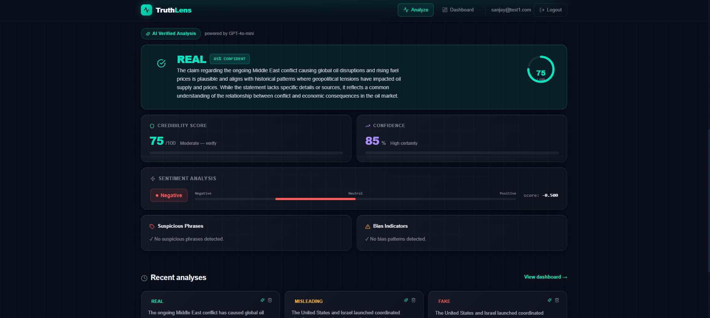
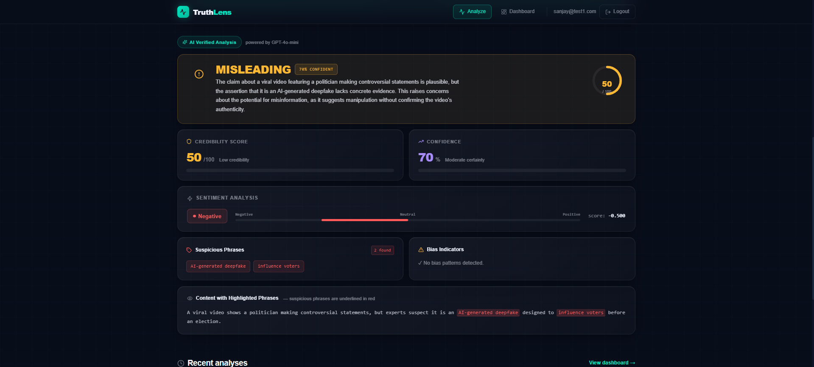
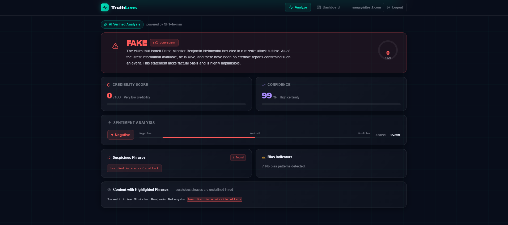
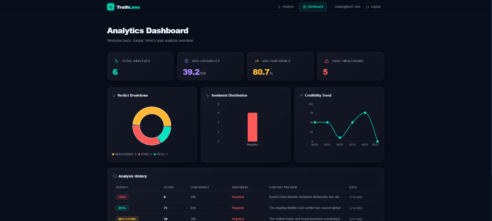
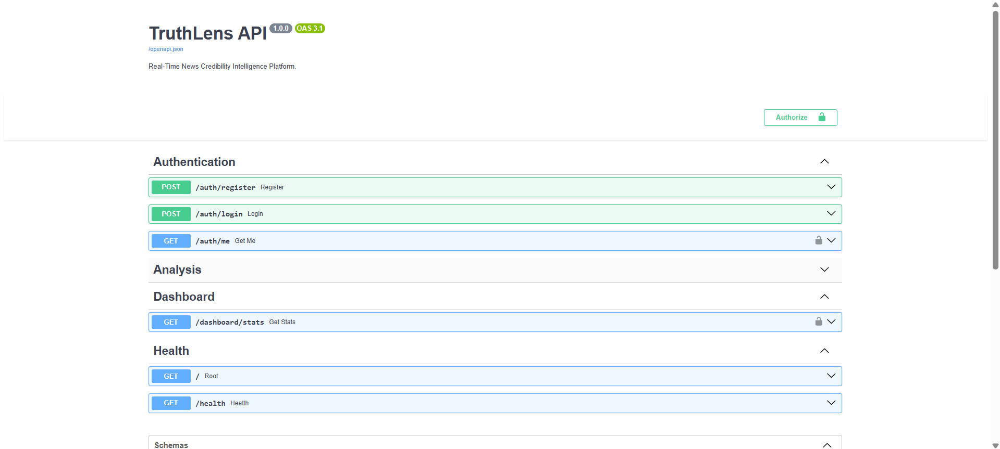

# 🚀 TruthLens — AI-Powered News Credibility Analysis Platform

A production-ready full-stack platform for analyzing news credibility using heuristic NLP signals and LLM-enhanced reasoning.

---

---

## 🌐 Live Demo

- Frontend: https://truthlens-vcrb.vercel.app
- Backend Docs: https://truthlens-api-y0ak.onrender.com/docs

---

## 🚀 Tech Stack

- Frontend: Next.js, TypeScript, Tailwind CSS
- Backend: FastAPI, Python
- Database: PostgreSQL
- Auth: JWT
- AI: OpenAI API
- Deployment: Vercel, Render

---

## 🔥 Features

- User registration and login
- JWT-protected endpoints
- News credibility scoring
- Sentiment analysis
- Bias detection
- Analysis history dashboard
- AI-enhanced reasoning (GPT-powered)

---

## 🏗 Architecture

- Vercel-hosted Next.js frontend  
- Render-hosted FastAPI backend  
- Render PostgreSQL database  
- OpenAI-powered analysis layer  

---

## 📈 How It Works

1. User submits a news article or claim  
2. Backend analyzes:
   - Sentiment
   - Suspicious phrases
   - Bias indicators  
3. AI enhances reasoning using OpenAI  
4. System generates:
   - Credibility score
   - Confidence score
   - Explanation  
5. Results are stored and shown in dashboard  

---

## 📸 Screenshots

### 🧾 Registration Page

### 🔐 Login Page

---

### 🔍 Analyze Page

---

### 🧠 Analysis Results

#### 🔍 Real News Analysis

#### ⚠️ Misleading Analysis

#### ❌ Fake News Analysis

---

### 📊 Dashboard

### ⚙️ Swagger Docs

---

## 🔐 Security

- Password hashing (bcrypt)  
- JWT-based authentication  
- Protected API endpoints  
- Secure environment variable handling  

---

## 🚀 Deployment

- Frontend deployed on Vercel  
- Backend deployed on Render  
- PostgreSQL hosted on Render  

---

## ⭐ Why My Project Stands Out

- Solves real-world misinformation detection problem  
- Full-stack + AI integration  
- Production deployment (not just local project)  
- Clean UI + scalable backend design  

---

## 👨‍💻 Author

Sanjay Gunda
